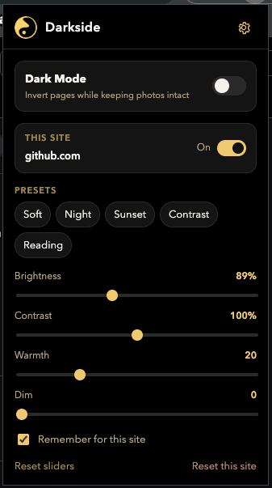
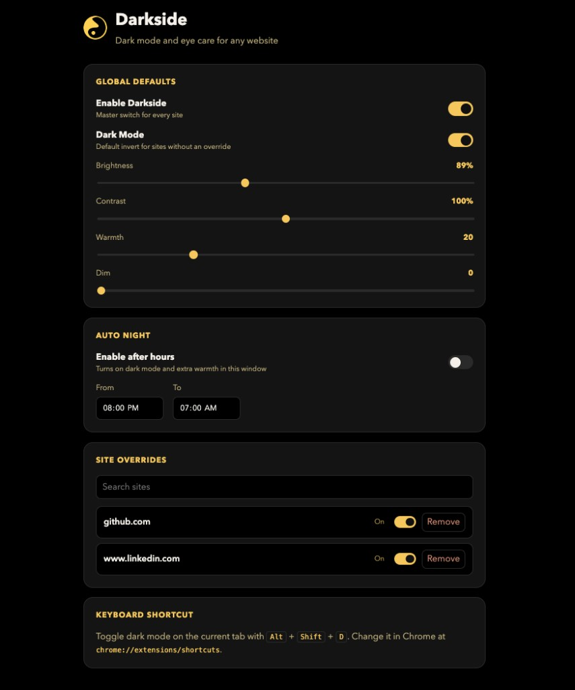

# Darkside

Darkside is a Chrome extension that makes any website easier on the eyes. Turn on Dark Mode to invert a page (photos and videos stay true-color), or leave invert off and only use brightness, contrast, warmth, and dim. Presets change those eye-care sliders and do not turn invert on. Each site keeps its own slider and Dark Mode settings.

This project is still in the works and unpublished. If you want to use it, clone the repo and run the extension locally — see [Run locally](#run-locally).

## UI

Popup — dark mode, this-site toggle, presets, and sliders:



Settings — global defaults, auto night, and per-site settings:



## Run locally

1. Clone the repo:

   ```bash
   git clone git@github.com:dmendoza05/darkside.git
   cd darkside
   ```

2. Open Chrome and go to `chrome://extensions`
3. Turn on **Developer mode** (top right)
4. Click **Load unpacked** and select this `darkside` folder
5. Pin Darkside from the puzzle-piece menu and click the icon

Restricted pages (`chrome://`, the Chrome Web Store, and other extension pages) cannot be restyled.

After you change the code, click **Reload** on the Darkside card in `chrome://extensions`, then refresh the tab you are testing.

## Using it

- **Dark Mode** — invert the current page; images and video stay true-color
- **This site** — turn Darkside off for the current hostname
- **Presets** — Soft, Night, Sunset, Contrast, Reading (eye-care only; does not turn on invert)
- **Sliders** — Brightness, Contrast, Warmth, Dim (work with Dark Mode off). Changes save for the current site
- **Reset this site** — drop that site’s custom settings and use the global defaults
- **Settings** (gear) — global defaults, auto-night window, and a list of per-site settings

Keyboard shortcut: `Alt` + `Shift` + `D` toggles dark mode on the current tab. Change it at `chrome://extensions/shortcuts`.

A few canvas-heavy apps or unusual CSS pages may look off. Turn the site off in the popup, or use **Reset this site**.
